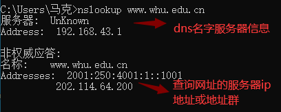
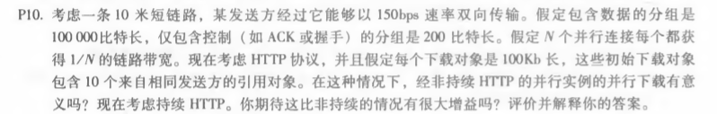
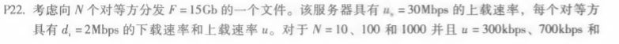
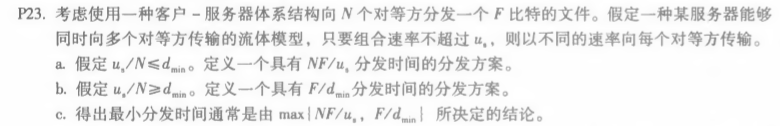

# 作业四

 						*马克*

#### 一，nslookup www.whu.edu.cn

​		NSLOOKUP是NT、2000中连接DNS服务器，查询域名信息的一个非常有用的命令，可以指定查询的类型，可以查到DNS记录的生存时间还可以指定使用哪个DNS服务器进行解释。在已安装TCP/IP协议的电脑上面均可以使用这个命令。主要用来诊断域名系统(DNS) 基础结构的信息。下面是测试截图信息。

​		其中，如图所示，上面部分是dns名字服务器的信息，下面是查询网址的信息。

#### 二，计算机网络（中文版）第二章习题练习

答：十米的短链路，以下忽略其传播时延。

非持续http并行示例的并行下载：
$$
（200b/150bps)*3+((10^5)b/150bps)+(200b/(150bps/10))*3+((10^5)b/(150bps/10))=7377.3s
$$

持续http：
$$
（200b/150bps)*3+((10^5)/150bps)+10*(200b/150bps+(10^5)b/(150bps/10))=7351s
$$
比较可得并未获得极大增益。

###### 对于客户—服务器：

$$
t=max\{NF/u_s,F/d_i\}
$$

| N    | t       |
| ---- | ------- |
| 10   | 7500s   |
| 100  | 50000s  |
| 1000 | 500000s |

###### 对于P2P

$$
t=max\{F/u_s,F/d_i,NF/(u_s+Nu)\}
$$

| u\N    | 10    | 100    | 1000     |
| ------ | ----- | ------ | -------- |
| 300kps | 7500s | 25000s | 45454.5s |
| 700kps | 7500s | 15000s | 20547.9s |
| 2Mbps  | 7500s | 7500s  | 7500s    |

答：a：服务器并行向客户端发送文件的速率：
$$
u_s/N<=d_{min}
$$
此时客户端也以该速率下载文件，则接收时间：
$$
F/（u_s/N)=NF/u_s
$$
b：此时dmin更小，因此服务器可以支持以该速率下载

接收时间为：F/dmin

c：当us/N<=dmin时，N/us>=1/dmin,NF/us>=F/dmin

此时t=NF/us=max{NF/us,F/dmin}

当us/N>=dmin时，N/us<=1/dmin,NF/us<=F/dmin

此时t=F/dmin=max{NF/us,F/dmin}

综上：最小分发时间为：max{NF/us，F/dmin}

