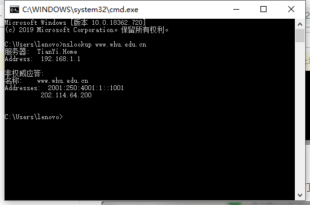

# 网络及分布式计算-Homework4

2017302580026 郑慧                          2020年3月24日

**nslookup www.whu.edu.cn**

​		nslookup命令用于查询DNS的记录，查看域名解析是否正常，本次实验中使用nslookup命令直接查询www.whu.edu.cn的域名记录，实验截图如下：

**第二章习题选做3道**

*P22.*

* 客户机-服务器

对于客户机-服务器体系结构，实际发送时间 = max{ NF/us, F/di }；与u无关，故可以绘制图表如下：

| N (u任意) | t       |
| --------- | ------- |
| 10        | 7500s   |
| 100       | 50000s  |
| 1000      | 500000s |

* P2P

对于P2P体系结构，实际发送时间 = max{ F/us, F/di, NF/(us+N*u) }；故可以绘制图表如下：

| t               | N = 10 | N = 100 | N = 1000 |
| --------------- | ------ | ------- | -------- |
| **u = 300kbps** | 7500s  | 25000s  | 45455s   |
| **u = 700kbps** | 7500s  | 15000s  | 20548s   |
| **u = 2Mbps**   | 7500s  | 7500s   | 7500s    |

*P23.*

*a.* 服务器并行的向每个客户端发送文件，而us/N <= dmin，此时限制总时间的瓶颈为us，故每个客户端的下载速率均为us/N，总时间 = F/(us/N) = NF/us

*b.*  服务器并行的向每个客户端发送文件，而us/N >= dmin，即us >= Ndmin，故服务器的上传速率足够支撑，总时间是由dmin限制的，总时间 = F/dmin。

*c.* 由*a*，*b*的分析可知，总时间总是由限制因素决定的，取得是限制因素的取值，即

当 us/N <= dmin 时：NF/us >= F/dmin，总时间 = NF/us = max{NF/us, F/dmin}；

当 us/N >= dmin 时：NF/us <= F/dmin，总时间 = F/dmin = max{NF/us, F/dmin}；

故最小分发时间为 max{NF/us，F/dmin}

*P25.*

由题意可知，N个活跃对等方，故节点数为N；每对对等方有一条活跃的TCP连接，则边数为N(N-1)/2。