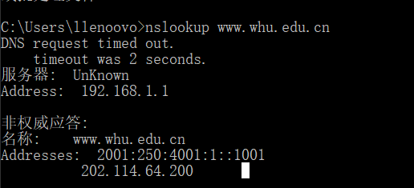

# 第四次作业

**2017302580214 曾志昊**

----

## nsloopup

unknown问题原因：我们一般习惯性只使用默认的正常查找区域，也就是只使用DNS服务器把域名解析成IP地址的功能。实际上DNS服务器还有一个反向查找区域，就是能把IP地址解析成域名。出现上述情况，是因为没有创建反向查找区域，DNS服务器无法根据自己的IP地址解析成对应的域名。

-----

## 课后作业

### p11

​		考虑在前一个习题中引出的情况。现在假定该链路由Bob和4个其他用户所共享。Bob使用非持续HTTP的并行实例，而其他4个用户使用无并行下载的非持续HTTP

​		a.Bob的并行连接能够帮助他更快地得到Web页面吗？
​		b.如果所有5个用户打开5个非持续HTTP并行实例，那么Bob的并行连接仍将是有好处的吗？为		什么?

> a. 能，并行的连接说明同一时刻更多的连接，链路带宽增大
>
> b.仍然有好处，服务器同时能处理的连接数量有限，越多的并行连接就意味着越高的占用，更高的带宽，如果bob只开启一个连接则会被其他用户的并行连接“挤占”，带宽降低。

**p14**

​		SMTP是怎样标识一个报文体结束的？ HTTP是怎样做的呢？ HTTP能够使用与SMTP标识一个		报文 体结束相同的方法吗？试解释。

> SMTP：使用一个“只包含句号的行” 
>
> HTTP：content-length 标识长度
>
> 不能：因为报文内容可能含有句号，而且HTTP消息可以是二进制数据，SMTP消息主体必须是7位的ASCII格式。

**p26**

​		假定Bob加入BitTorrent,但他不希望向任何其他对等方上载任何数据（因此称为搭便车）。
​		a.Bob声称他能够收到由该社区共享的某文件的完整副本。Bob所言是可能的吗？为什么？
​		b.Bob进一步声称他还能够更为有效地进行他的“搭便车”，方法是利用所在系的计算机实验室中 	的多台计算机（具有不同的IP地址）。他怎样才能做到这些呢？

> a. 可能的，因为如果“torrent"中没有其他的用户，他也能从服务器处不断下载文件块得到一个完整的文件，如果”torrent“中有其他用户，bob可以从其他用户处得到文件块，缺失的文件块还可以从服务器处得到。
>
> b. 在多台计算机上都加入torrent进行下载，并且开启上载，torrent中的用户越多，在torrent中的文件块数量越多，并且最稀缺优先技术能够均衡torrent中的块的稀缺性，越多的用户更能起到均衡的作用，也能使稀缺文件块更快的传输到bob的电脑上。