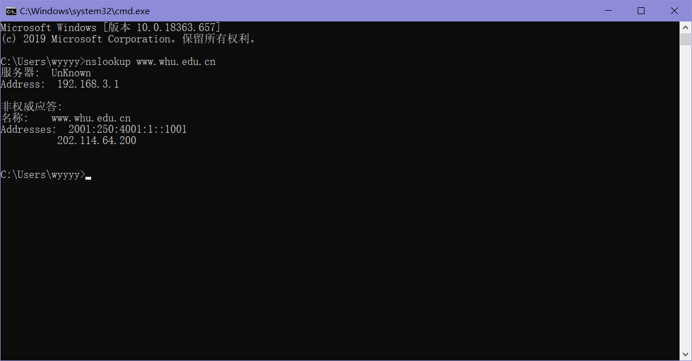

# nslookup ww.whu.edu.cn

# P5

a）状态代码200和短语ok表示服务器能够找到文档成功。答复于2008年3月7日星期二提供格林威治标准时间12:39:45。

b）上一次修改index.html文档是在2005年12月10日星期六18:27:46 格林尼治时间。

c）返回的文档中有3874个字节。

d）返回文件的前五个字节是：<！医生服务器同意持久连接，如connection:Keep Alive字段所示

P6、 a）在RFC 2616的第8节中讨论了持久连接（这一点的真正目的问题是让你检索并阅读一份RFC）第8.1.2和8.1.2.1节 rfc表示客户机或服务器可以向另一个表明它是将关闭永久连接。它通过包含连接令牌来实现“关闭”在http请求/回复的连接头字段中。

b）http不提供任何加密服务。

c)（来自rfc 2616）“使用持久连接的客户端应该限制同时维护到给定服务器的连接。单用户客户端与任何服务器或代理服务器的连接不应超过2个。”

d)是。(来自RFC 2616)“在服务器决定关闭”空闲“连接的同时，客户端可能已经开始发送新请求。从服务器的角度来看，连接是在空闲时关闭的，但从客户端的角度来看，请求正在进行中。“

# P13

来自:inSMTP的邮件是从SMTP客户端发送的标识发件人的邮件将邮件消息发送到SMTP服务器。

发件人：在邮件消息本身不是SMTP邮件，而不是邮件正文中的一行。