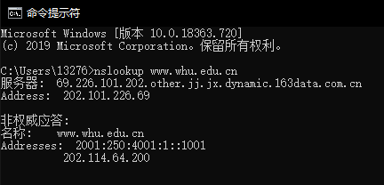

## 一、nslookup

### 1、nslookup 作用：

​		nslookup用于查询DNS的记录，查询域名解析是否正常，在网络故障时用来诊断网络问题。

### 2、nslookup www.whu.edu.cn

## 二、习题

### P13：

​		MAIL FROM：信封上的发件人, 由「前缀@域名」组成. 此域名就是所谓的发信域名。

​		FROM：信件内容里的发件人. 用户可以任意填写, 支持别名显示。

### P14：

​		SMTP以单行句号标识报文体结束，

​		HTTP用Content-Length标识；

​		HTTP不可使用句号，因为其报文内容可能含有句号。

### P27

​		a）、N²

​		b）、2N