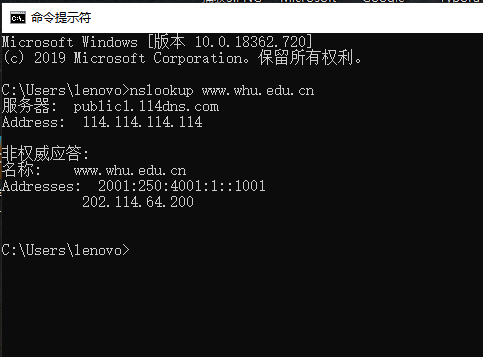

# 一、nslookup www.whu.edu.cn

结果：



# 二、课后题

##### P12.写一个简单的TCP程序，使服务器接收来自客户的行并将其打印在服务器的标准输出上。（可以通 过修改本书中的TCPServer. py程序实现上述任务。）编译并执行你的程序。在另一台有浏览器的机 器上，设置浏览器的代理服务器为你正在运行服务器程序的机器，同时适当地配置端口号。这时你 的浏览器向服务器发送GET请求报文，你的服务器应当在其标准输出上显示该报文。使用这个平台 来确定你的浏览器是否对本地缓存的对象产生了条件GET报文。 

```
from socket import * 
serverPort=12000 
serverSocket=socket(AF_INET,SOCK_STREAM) 
serverSocket.bind(('',serverPort)) 
serverSocket.listen(1) 
connectionSocket, addr = serverSocket.accept() 
while 1: 
 sentence = connectionSocket.recv(1024) 
 print 'From Server:', sentence, '\n' 
serverSocket.close() 
```

##### P13.SMTP中的MAIL FROM与该邮件报文自身中的From：之间有什么不同？

MAIL FROM:发件人邮箱，发送到SMTP服务器

From：邮件消息的内容

##### P14.SMTP是怎样标识一个报文体结束的？ HTTP是怎样做的呢？ HTTP能够使用与SMTP标识一个报文 体结束相同的方法吗

SMTP使用仅包含.的行来标记邮件正文的结束。http使用content length来表示消息正文的长度。不，HTTP不能使用SMTP使用的方法，因为HTTP消息可以是二进制数据，而在SMTP中，消息主体必须是7位的ASCII格式。