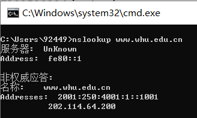

# nslookup #

----------

# 习题10 #
考虑一条10米短链路，某发送方经过它能够以150bps速率双向传输。假定包含数据的分组是 100 000比特长，仅包含控制（如ACK或握手）的分组是200比特长。假定N个并行连接每个都获 得1/W的链路带宽。现在考虑HTTP协议，并且假定每个下载对象是】00Kb长，这些初始下载对象 包含10个来自相同发送方的引用对象。在这种情况下，经非持续HTTP的并行实例的并行下载有意 义吗？现在考虑持续HTTP。你期待这比非持续的情况有很大增益吗？评价并解释你的答案。

----------
10米短链路，忽略其传播时延。

带有并行连接的非持续连接且并行下载：
(200b / 150bps) * 3 + ((10^5)b/ 150bps) + (200b / (150bps / 10)) * 3 + ((10^5)b / (150bps / 10)) = 7377.3s

持续连接：
(200b / 150bps) * 3 + ((10^5)b / 150bps) + 10 * (200b/150bps + (10^5)b/150bps) = 7351s
# 习题23 #
考虑使用一种客户-服务器体系结构向N个对等方分发一个F 比特的文件。假定一种某服务器能够同时向多个对等方传输的流体模型，只要组合速率不超过us，则以不同的速率向每个对等方传输。

a. 假定us/N≤dmin.定义一个具有*NF/us*分发时间的分发方案。

b. 假定us/N≥dmin.定义一个具有*F/dmin*分发时间的分发方案。

c. 得出最小分发时间通常是由max{NF/us, F/dmin}所决定的结论。

----------
a. 服务器向每个客户端并行发送文件，此速率为 us/N，因为 us/N <= dmin，所以客户端也以该速率下载。则每个客户端接收完文件的时间为 F / (us / N) = NF / us

b. 仍然考虑服务器向每个客户端并行发送文件，以 dmin 为速率，因为 us/N >= dmin，所以 us >= Ndmin，故服务器可以承受此速率，各服务器以 dmin 为下载速率，故接收时间为 F/dmin

c. 当 us/N <= dmin 时：N/us >= 1/dmin,NF/us >= F/dmin,此时 t = NF/us = max{NF/us, F/dmin}

当 us/N >= dmin 时：N/us <= 1/dmin,NF/us <= F/dmin,此时 t = F/dmin = max{NF/us, F/dmin}

因此：得出最小分发时间为 max{NF/us，F/dmin}
# 习题25 #
考虑在一个有N个活跃对等方的覆盖网络中，每对对等方有一条活跃的TCP连接。此外，假定该 TCP连接通过总共M台路由器。在对应的覆盖网络中，有多少节点和边？

----------
节点：N，边：N(N-1)/2

